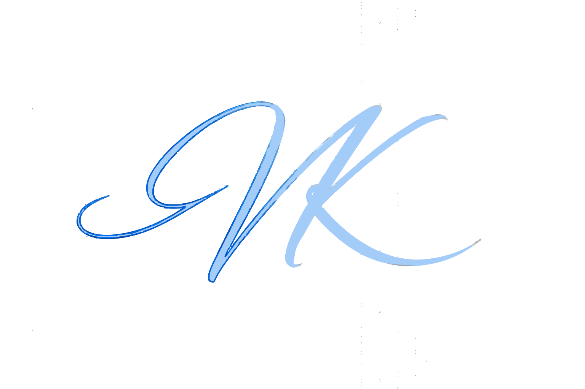

<div align="center">



# Vivek — Technical Portfolio

### Engineering AI Systems, Full Stack Web Applications, and EdTech Architectures

[](https://nextjs.org/)
[](https://react.dev/)
[](https://www.typescriptlang.org/)
[](https://tailwindcss.com/)
[](https://vercel.com/)

[](https://vivek-portfolio.vercel.app)
[](https://github.com/webdeveloperdesigner)
[](https://linkedin.com/in/vivek-vns)

---


</div>

---

## Executive Summary

A production-grade, highly interactive portfolio application engineered to showcase technical expertise across Full Stack Web Development, Artificial Intelligence, and Modern EdTech Systems. Moving beyond traditional static documentation, this platform delivers an immersive, high-performance user experience powered by Next.js 16 (Turbopack), React 19, Framer Motion choreographies, custom matrix rain terminal loaders, and responsive theme-adaptive design systems.

---

## System Architecture & Technologies

The repository is built on a modern, decoupled architecture designed for maximal performance, scalability, and strict type safety.

### Core Framework

- **Next.js 16 (App Router & Turbopack):** Leverages server-side rendering (SSR), static site generation (SSG), and advanced caching mechanisms for ultra-fast page loads.
- **React 19 & TypeScript:** Enforces strict type safety and modern reactive paradigms across 40+ custom UI components.

### UI Choreography & Animations

- **Framer Motion:** Drives complex timeline choreographies, interactive tilt card mechanics, page transitions, and smooth scroll behaviors.
- **Tailwind CSS v4 & custom variants:** Implements `@custom-variant dark (&:where(.dark, .dark *));` to ensure 100% synchronized Light & Dark mode transitions.
- **Lucide Icons:** Provides crisp, accessible SVG icon primitives across desktop navigation pills and mobile accordion drawers.

### System Features & Engines

- **Cyber Matrix Terminal Loader:** Generates a real-time Katakana & Latin rain canvas animation during initial system boot (`PageLoader.tsx`), persisting state in `sessionStorage` for zero-lag subsequent navigation.
- **Interactive Presentation Deck (`/me`):** A slide-based pitch presentation featuring keyboard (`↑` / `↓`) and wheel scroll navigation.
- **Technical Blog Engine (`/writings`):** MDX and custom dataset rendering for deep-dive engineering experiences (e.g., Shaastra 2026 @ IIT Madras, MLOps deployments, and Blockchain architectures).

---

## Project Structure

```text
v2-portfolio/
├── src/
│   ├── app/                          # Next.js 16 App Router Routes
│   │   ├── case-studies/             # Deep-Dive Engineering Case Studies
│   │   ├── gallery/                  # Visual UI & Design Artifacts Showcase
│   │   ├── me/                       # Interactive Slide Deck Presentation
│   │   ├── projects/                 # Comprehensive Projects Directory & Archive
│   │   ├── timeline/                 # Chronological Career Milestones
│   │   └── writings/                 # Technical Blog & Articles Engine
│   ├── components/
│   │   ├── Navbar.tsx                # Floating Navigation Pill with Explore Dropdown
│   │   ├── Hero.tsx                  # Interactive Hero Section & Tech Stack Badge Grid
│   │   ├── Projects.tsx              # Featured Project Showcase & Filter Tabs
│   │   ├── ProjectCard.tsx           # Adaptive Project Card Component
│   │   ├── Services.tsx              # Engineering Disciplines & Tilt Cards
│   │   ├── WritingsSection.tsx       # Homepage Featured Blog Articles Grid
│   │   ├── ExperienceSkills.tsx      # Career Track & Watermark Metrics
│   │   ├── About.tsx                 # Core Philosophy & Background Summary
│   │   ├── Contact.tsx               # Floating Label Contact Form with High-Contrast CTA
│   │   ├── PageLoader.tsx            # Cyber Terminal Boot Screen
│   │   └── TiltCard.tsx              # 3D Gyroscope & Spotlight Tilt Container
│   └── data/
│       ├── caseStudies.ts            # Architectural Case Studies Database
│       ├── projects.ts               # Project Repositories & Demos Store
│       └── writings.ts               # Blog Articles & Experience Documentation Store
├── public/                           # Static Assets (Logos, SVGs, Favicon, CV PDF)
├── next.config.ts                    # Next.js Optimization Configuration
└── tailwind.config.ts                # Design System Directive Config
```

---

## Key Features

### 1. 6.0 Explore Dropdown & Mobile Accordion

Includes a floating desktop navigation pill (`6.0 EXPLORE ▾`) with smooth Framer Motion animations and an interactive mobile drawer accordion featuring quick links to Case Studies, Gallery, Timeline, About Presentation, and Projects Archive.

### 2. Autonomous Cyber Matrix Loader

Features a matrix code rain canvas simulator executing system kernel initialization steps (`[SYS_INIT] INITIALIZING KERNEL v2.4...`) with automatic session caching (`sessionStorage`).

### 3. Interactive Pitch Deck (`/me`)

Delivers a slide presentation built with React state & Framer Motion `AnimatePresence`, supporting keyboard arrow navigation and mouse wheel scrolling to present mission, tech stack, and flagship product (**BodhAI**).

### 4. Floating-Label Form & Dual-Theme Adaptation

Includes a contact form with floating labels (`peer-[:not(:placeholder-shown)]:-top-3`), zero placeholder overlap, and high-contrast Light/Dark mode themes tested across all 17 static and dynamic Next.js routes.

---

## Local Development Setup

### Prerequisites

- Node.js >= 18.0.0
- npm >= 9.0.0

### Installation

1. **Clone the repository:**

   ```bash
   git clone https://github.com/webdeveloperdesigner/v2-portfolio.git
   cd v2-portfolio
   ```

2. **Install dependencies:**

   ```bash
   npm install
   ```

3. **Initialize Development Server:**
   ```bash
   npm run dev
   ```
   Navigate to `http://localhost:3000` to interact with the application.

### Production Build & Verification

Execute the following to run type checks and compile the optimized production bundle:

```bash
npx tsc --noEmit
npm run build
npm run start
```

---

## Project Showcase Overview

The platform documents technical projects and products spanning multiple software disciplines:

| Discipline                           | Notable Projects                                           | Core Technologies                                         |
| :----------------------------------- | :--------------------------------------------------------- | :-------------------------------------------------------- |
| **Artificial Intelligence & EdTech** | BodhAI, AI Proctoring Engine, Smart Assessment Platform    | Python, React.js, Firebase, OpenCV, AI Automation         |
| **Full Stack Web Engineering**       | Personal Portfolio v2, E-Commerce Portals, SaaS Platforms  | Next.js 16, React 19, TypeScript, Tailwind CSS v4, Convex |
| **Backend & Cloud Architecture**     | Microservice APIs, User Analytics Engine, Data Pipelines   | Node.js, Express.js, MongoDB, PostgreSQL, Firebase Auth   |
| **UI/UX & Interactive Design**       | 3D Tilt Card System, Cyber Terminal Loader, Design Systems | Framer Motion, Tailwind CSS, Figma                        |

---

## License

This project is licensed under the [MIT License](LICENSE).

<div align="center">
  <p>Engineered by Vivek </p>
</div>
